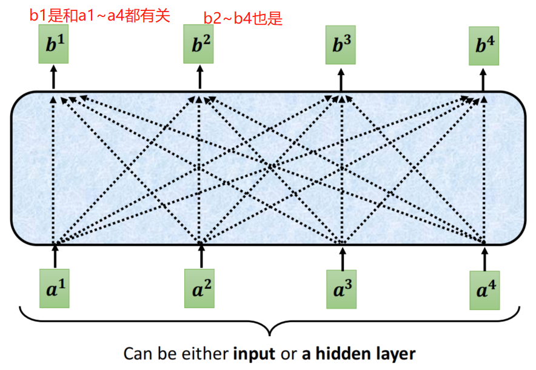

# Self-attention

## 1. 输入的多样性

我们知道输入到网络中的数据是多样的，可以是**一个句子**，**一个音频**，**一个图**，甚至是**一个分子结构**。那我们如何去表示输入的数据呢？往往需要用到**词向量**，如图所示：

而把句子编码成词向量的方式有很多种，例如One-hot Encoding，Word Embedding,如图所示：

当然除了句子之外，音频，图等也能作为一个向量。这里就不多加举例，后面遇到了再说。

## 2. 输出的多样性

### 2.1 分类

① N2N结构

这是RNN最基本的结构之一，要求输入和输出的序列等长。一般用于诗词生成。或者判断一个句子的词性。

再来看判断一个句子词性的例子，假设输入"I saw a saw"，然后得到相应的词性，如图所示：

② N21结构

常用于文本分类，输入的是一个序列，输出的是一个单独的值。

③ 1toN结构

常用于"看图说话"，就是图片生成文字的任务上，输入是一个值，输出为一个序列。

④ N2M结构

这是一种**不限输入输出长度**的RNN结构, 它由**编码器和解码器两部分组成**, 两者的内部结构都是某类RNN, 它**也被称为seq2seq**架构. 输入数据首先通过编码器, 最终输出一个隐含变量c, 之后最常用的做法是使用这个隐含变量c作用在解码器进行解码的每一步上, 以保证输入信息被有效利用.

**seq2seq也就是N2M的结构，因为输入输出不受限，所以是应用最广的RNN模型。**

### 2.2 存在的问题？		

#### 2.2.1 问题1

我们来思考这样一个问题，假设有这样一句话："过去的人在想**什么东西能吃**？现在的人在想**什么东西能吃**？"，对于"什么东西能吃"这句话，在我们人类看来，所代表的含义完全不同，但是如果只是输入到FC网络中，得到一个结果，那同样的输入，不可能得到不同的结果。

也就是说，在传统的word2vec中，输入的"什么东西能吃？"属于一个类别。这时候就需要考虑语境的作用。

考虑语境，有一种比较自然的方式，就是利用一个窗口window，在这个窗口里面去考虑，举个例子，假设"I saw a saw"这样一句话，窗口的大小是3，也就是框住了"I saw a"，我们知道saw是接在I后面的，所以大概率是V，然后继续滑动，框住"saw a saw"我们知道第二个"saw"是接在a后面的，所以大概率是N.如图所示：

那如果有时候，我们需要考虑整个句子，该怎么做呢？用一个窗口覆盖整个句子的做法显然不合适，这就要用到Self-attention.

## 3. Self-attention

自注意力机制能找到上下文之间的关系，我们先来看整体结构，如图所示：

那具体Self-attention怎么起作用的呢？

以b1为例，我们怎么得到b1呢？这就要得到a1和a2~a4的相关性α，那这个相关性α怎么得到呢？

α=q·k，那q和k分别代表什么呢？我们一个个来拆解一下。

接下来就是来看b1怎么得到了，如图所示：

b1的公式如下：

依次类推，可以求出b1,b2,b3,b4

